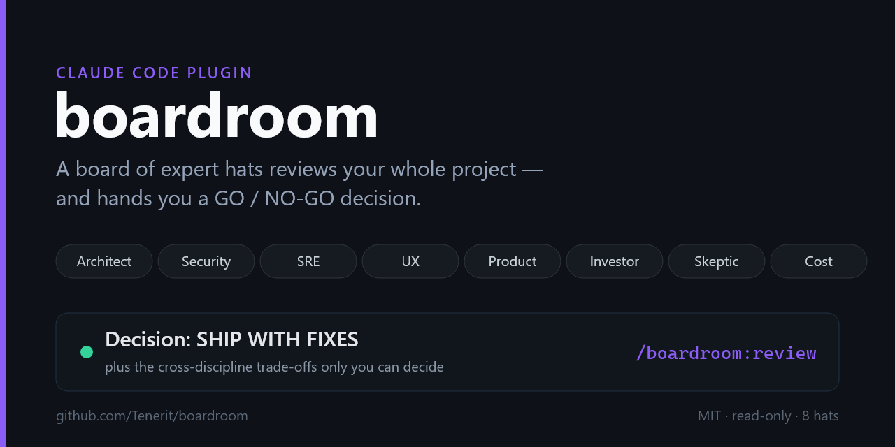

# 🪑 boardroom

**Your project, reviewed by a board of experts — and handed a decision.**

[](https://docs.claude.com/en/docs/claude-code/plugins)
[](CHANGELOG.md)
[](#privacy)
[](CONTRIBUTING.md)
[](LICENSE)



`boardroom` is a Claude Code plugin. Run `/boardroom:review` and a panel of expert
hats — architect, security, SRE, UX, product, investor, skeptic, cost — each study
your project **in parallel** through their own lens. The chair then hands you a
**GO/NO-GO decision** and, more importantly, the **trade-offs you have to decide**
yourself.

It answers *"should we ship / buy / invest in / trust this?"* — not *"is this PR
mergeable?"*

> ⚖️ **boardroom doesn't converge to "truth" — it exposes _structured disagreement_ for a human to arbitrate.** The decision (and confidence) are signals for *you* to weigh, not an oracle's verdict.

---

## Who it's for

You'll get value if you're one of these — and the page below should make you think
*"this is for me"* in 10 seconds:

- **The solo dev / OSS maintainer** auditing their own project before a release or
  a launch — *"I built this alone; what would a team of experts flag?"*
- **The CTO / tech lead doing fast due diligence** on a repo before adopting,
  buying, or integrating it — *"is this worth betting on, and where's the risk?"*
- **The plugin/tool author** who wants a second opinion that spans business *and*
  engineering, not just code style.

If you only need line-by-line code review of a diff, a code-review tool is a better
fit — boardroom is for **whole-project, ship/no-ship judgment**.

---

## See it in 10 seconds

```
# Boardroom review — acme-billing

## Decision: NOT YET
Core billing logic is solid, but a money-touching race condition and an
unauthenticated webhook make this unsafe for paying customers. Two fixes gate it.

## Decisions for you  (no single right answer — you choose)
- Hit the announced EU launch date vs add idempotency first.
  Product wants the date; SRE+Security show the retry path can double-bill.
  → What resolves it: slip one week, or gate EU behind a flag until it lands?
...
```

👉 **[Read a full sample report →](examples/sample-review.md)** · or a **[real run of boardroom reviewing itself →](examples/real-review-boardroom-v0.6.md)**

---

## Quickstart

```bash
# 1. load it
claude --plugin-dir ./boardroom

# 2. review the current project
/boardroom:review
```

Or install from the marketplace:

```
/plugin marketplace add Tenerit/boardroom
/plugin install boardroom@tenerit
```

Then: `/boardroom:review` · `/boardroom:review src/` · `/boardroom:review --hats=security,sre` · `/boardroom:review --debate`

---

## Why boardroom (vs other review tools)

| | Code-review panels | Multi-**model** councils | **boardroom** |
| --- | --- | --- | --- |
| Reviews | a diff | a question, across vendors | **the whole project** |
| Hats | engineering only | one per model | **engineering + business** |
| Output | findings / merge verdict | side-by-side answers | a **GO/NO-GO decision** |
| Disagreement | a judge picks a winner | consensus vs divergence | **surfaced as a decision *you* make** |

A code reviewer can settle "is this correct?". The board's job is the question with
no correct answer: *"is it worth shipping — and what do we trade off to get there?"*

---

## The board

| Hat | Looks at |
| --- | --- |
| 🏛️ **Architect** | system design, coupling, complexity, tech debt |
| 🔒 **Security** | authz, secrets, injection, SSRF, supply chain |
| 🛠️ **SRE** | reliability, failure modes, observability, deploy/rollback |
| 🎯 **UX** | first-run friction, clarity, hierarchy, consistency |
| 📦 **Product** | who it's for, problem fit, scope, positioning |
| 💰 **Investor** | moat, market, traction, kill-risks |
| 🕵️ **Skeptic** | red-teams the headline claim and the load-bearing assumptions |
| 🧮 **Cost** | what your LLM/API calls actually cost (seated only if you call one) |

Every hat is **read-only** — the board diagnoses, it never touches your code. The
**Cost** hat is unique to boardroom; no other panel judges your token bill.

---

## How it works

The `/boardroom:review` skill acts as the **chair**:

1. **Recon once** → builds a shared project map (so seven hats don't each re-read the repo).
2. **Assembles the right board** → matches hats to the project type (a script gets 2 hats; a SaaS gets all of them).
3. **Convenes in parallel** → each hat reviews its lane in its own context window.
4. **Decides** → reconciles the verdicts into the decision + trade-offs report.

Add `--debate` for a rebuttal round: hats see the *conflicts* and get to defend,
concede, or refine before the chair rules — scoped to the disagreements, so it stays cheap.

---

## Built to be cheap

Multi-agent reviews burn tokens; boardroom minimizes it:

- **Recon once, not N times** — one shared map, passed to every hat.
- **Read budget** — each hat opens only its lane (~≤12 files) and cites instead of pasting.
- **Model tiering** — deep-code hats use your session model; judgment hats default to a lighter one.
- **Right-sized panel** — smart assembly + `--hats=` keep focused runs small.

---

## Add your own hat

Hats are just markdown subagents in [`agents/`](agents/). Copy one, change the lens
and the verdict header, add a row to the table in
[`skills/review/SKILL.md`](skills/review/SKILL.md). Each hat returns the same verdict
contract (score · strengths · severity-tagged risks · top-3 actions · cross-discipline
flag · one hard question) — that uniformity is what makes the chair's synthesis clean.

Good additions: `board-legal`, `board-data` (privacy/compliance), `board-perf`.

---

## Privacy

boardroom runs entirely inside your Claude Code session against your local files. It
adds no network calls of its own and the hats never write to your project.

## License

MIT — see [LICENSE](LICENSE).
