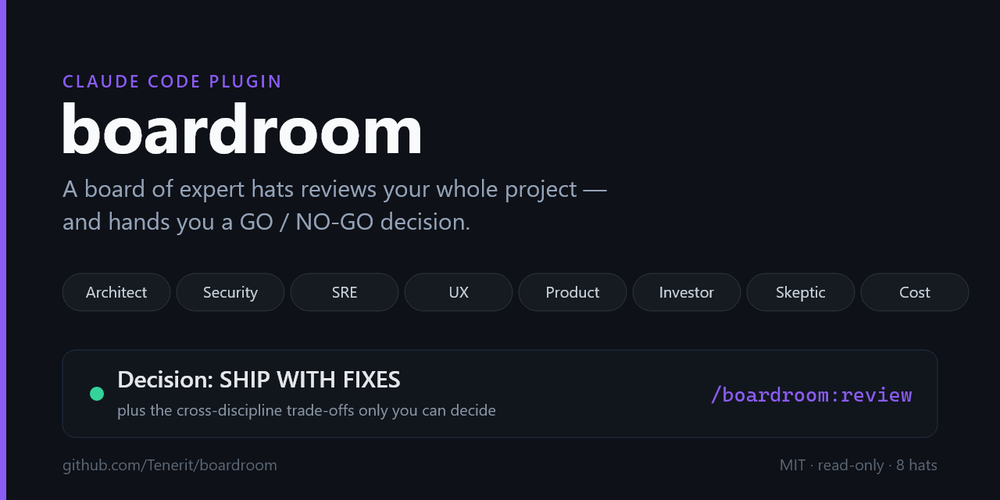

# 🪑 boardroom

**Your project, reviewed by a board of experts — and handed a decision.**

[](https://docs.claude.com/en/docs/claude-code/plugins)
[](CHANGELOG.md)
[](#privacy)
[](CONTRIBUTING.md)
[](LICENSE)



`boardroom` is a Claude Code plugin. Run `/boardroom:review` and a panel of expert
hats — architect, security, SRE, UX, product, investor, skeptic, cost — each study
your project **in parallel** through their own lens. The chair then hands you a
**GO/NO-GO decision** and, more importantly, the **trade-offs you have to decide**
yourself.

It answers *"should we ship / buy / invest in / trust this?"* — not *"is this PR
mergeable?"*

> ⚖️ **boardroom doesn't converge to "truth" — it exposes _structured disagreement_ for a human to arbitrate.** The decision (and confidence) are signals for *you* to weigh, not an oracle's verdict.

---

## Who it's for

You'll get value if you're one of these — and the page below should make you think
*"this is for me"* in 10 seconds:

- **The solo dev / OSS maintainer** auditing their own project before a release or
  a launch — *"I built this alone; what would a team of experts flag?"*
- **The CTO / tech lead doing fast due diligence** on a repo before adopting,
  buying, or integrating it — *"is this worth betting on, and where's the risk?"*
- **The plugin/tool author** who wants a second opinion that spans business *and*
  engineering, not just code style.

If you only need line-by-line code review of a diff, a code-review tool is a better
fit — boardroom is for **whole-project, ship/no-ship judgment**.

---

## See it in 10 seconds

```
# Boardroom review — acme-billing

## Decision: NOT YET · confidence: Medium
Core billing logic is solid, but a money-touching race condition and an
unauthenticated webhook make this unsafe for paying customers. Two fixes gate it.

**Confidence: Medium** — both blockers verified against source (2/2); SRE and Security
agree, but the security hat hit the read cap on the webhook layer.

## Decisions for you  (no single right answer — you choose)
- Hit the announced EU launch date vs add idempotency first.
  Product wants the date; SRE+Security show the retry path can double-bill.
  → What resolves it: slip one week, or gate EU behind a flag until it lands?
...
```

👉 **[Read a full sample report →](examples/sample-review.md)** · or a **[real run of boardroom reviewing itself →](examples/real-review-boardroom-v0.6.md)**

---

## Quickstart

```bash
# 1. load it
claude --plugin-dir ./boardroom

# 2. review the current project
/boardroom:review
```

Or install from the marketplace:

```
/plugin marketplace add Tenerit/boardroom
/plugin install boardroom@tenerit
```

> **`/boardroom:review` → "Unknown command"?** Your environment has no plugin system
> (e.g. an agent / cowork session — `/plugin` won't be available there either).
> boardroom needs an interactive **Claude Code CLI or desktop**. After install,
> run `/reload-plugins` or restart the session if the command isn't found yet.

### Modes & flags

| You want… | Run |
| --- | --- |
| A quick sanity pass (3 hats) | `/boardroom:review --light` |
| A normal review (5 hats) | `/boardroom:review --standard` |
| The full board | `/boardroom:review --deep` |
| Specific hats only | `/boardroom:review --hats=security,sre` |
| Scope to a folder | `/boardroom:review src/` |
| A rebuttal round on the conflicts | add `--debate` |

No flag? The chair auto-sizes the board to the project.

### Review every PR ⭐

The cheapest, most repeatable way to use boardroom — review only what *changed*,
on every pull request, before merge:

```
/boardroom:review --pr 42            # a GitHub PR
/boardroom:review --diff HEAD~1      # the last commit
```

The board scopes to the changed files (cheap — a diff is small), and the decision
becomes **"is this change safe to merge?"** — a 2-minute multi-hat gate on every
PR, not a one-off audit. This is the recurring workflow; the whole-project review
is for milestones (a launch, an acquisition, a quarterly health check).

---

## Why boardroom (vs other review tools)

| | Code-review panels | Persona / debate panels | **boardroom** |
| --- | --- | --- | --- |
| Reviews | a diff | code & plans (engineering lens) | **the whole project — business + technical** |
| Hats | engineering only | engineering personas | **engineering + business (investor/pm/ux) + a token-cost hat** |
| On conflict | a judge picks a winner | a judge picks a winner | **handed to *you* to arbitrate — no forced winner** |
| Output | findings / merge verdict | one verdict | a **GO/NO-GO decision + the trade-offs you own** |
| Trust signal | — | claim verification | **load-bearing findings verified + a confidence & agreement flag** |

A code reviewer can settle "is this correct?". The board's job is the question with
no correct answer: *"is it worth shipping — and what do we trade off to get there?"*

The strongest debate panels go deeper on verification machinery — and stay
engineering-only, and *resolve* the disagreement into a single verdict. boardroom's
job is the opposite: keep the no-right-answer trade-off **visible for the human to
own**, now backed by enough verification and a confidence signal that you can trust
the parts that *do* have a right answer.

---

## The board

| Hat | Looks at |
| --- | --- |
| 🏛️ **Architect** | system design, coupling, complexity, tech debt |
| 🔒 **Security** | authz, secrets, injection, SSRF, supply chain |
| 🛠️ **SRE** | reliability, failure modes, observability, deploy/rollback |
| 🎨 **UX** | first-run friction, clarity, hierarchy, consistency |
| 📦 **Product** | who it's for, problem fit, scope, positioning |
| 💰 **Investor** | moat, market, traction, kill-risks |
| 🕵️ **Skeptic** | red-teams the headline claim and the load-bearing assumptions |
| 🧮 **Cost** | what your LLM/API calls actually cost (seated only if you call one) |

Every hat is **read-only** — the board diagnoses, it never touches your code. The
**Cost** hat is unusual: it judges what *your* project's LLM/API calls cost — caching,
prompt bounding, signal pre-extraction — a lens that general "is this expensive?" takes
miss (seated only when your project actually calls a model).

---

## How it works

The `/boardroom:review` skill acts as the **chair**:

1. **Recon once** → builds a shared project map (so the hats don't each re-read the repo).
2. **Assembles the right board** → matches hats to the project type (a script gets 2 hats; a SaaS gets all of them).
3. **Convenes in parallel** → each hat reviews its lane in its own context window.
4. **Decides** → reconciles the verdicts into the decision + trade-offs report.

Add `--debate` for a rebuttal round: hats see the *conflicts* and get to defend,
concede, or refine before the chair rules — scoped to the disagreements, so it stays cheap.

---

## Built to be cheap

Multi-agent reviews burn tokens; boardroom minimizes it:

- **Recon once, not N times** — one shared map, built by the chair, passed to every hat.
- **Disjoint reads** — the chair *assigns* each load-bearing file to the 1–2 hats that
  need it, so the panel doesn't all open the same core files (the #1 duplicated cost).
- **Shared excerpts** — the few files every hat needs are pasted into the map once,
  instead of each hat re-reading the whole file.
- **Hard read cap per mode** — 5 files/hat on `--light`, 8 on `--standard`, 12 on `--deep`.
- **Model tiering** — deep-code hats use your session model; judgment hats a lighter one.
- **Right-sized panel** — smart assembly + `--hats=` keep focused runs small.

These cut the parts of the bill that scale with the number of hats (the reading), not
the output — so the report and the findings are unchanged.

---

## Built to be trusted

Every hat is the same base model, so a confident-sounding finding can still be a
hallucinated `file:line`, and unanimous agreement can be a shared blind spot rather
than signal. boardroom guards the verdict:

- **Findings are verified before they gate.** The chair spot-checks every 🔴
  ship-blocking finding against its cited source; one that doesn't hold is marked
  `⚠ unverified` and is not allowed to gate the decision.
- **Every hat tags its risks** `[seen]` (confirmed at the line) vs `[inferred]`
  (suspected) and reports its own **confidence** — so a guess never masquerades as fact.
- **The decision carries a confidence** (High / Medium / Low) from hat agreement,
  verification, and coverage. Low confidence reads as *"a prompt for human review, not
  a verdict"*.
- **Unanimity is flagged, not celebrated.** When the board fully agrees, the chair says
  so and names the independent evidence (a real run, a paying user, a benchmark) that
  would confirm it — consensus among same-model reviewers is a caution, not proof.
- **Findings are anchored to facts, not just opinion.** The chair runs the cheap
  deterministic checks the repo already declares (build, tests, lint, a secret grep,
  does-the-cited-line-exist) and demotes any 🔴 that contradicts a green check. LLM
  reviewers over-flag; ground truth is the cheapest filter for the false positives that
  are the #1 reason review tools lose trust.
- **Same facts, independent framing.** Every hat gets the same map + ground truth, but
  each is framed in its own discipline's terms — never one shared checklist. Shared
  framing on a shared base model manufactures false consensus.

> boardroom doesn't pretend to a certainty it lacks. It exposes *structured, verified
> disagreement* with a confidence attached — for a human to arbitrate.

**Prove it yourself.** A stability harness in [`eval/`](eval/METHODOLOGY.md) runs the board
N× on fixed fixtures and reports **decision variance** — the metric that actually measures
whether a review board is reliable (single-run LLM verdicts are near-arbitrary). Reliability
you can reproduce beats reliability you're asked to trust.

---

## Add your own hat

Hats are just markdown subagents in [`agents/`](agents/). Copy one, change the lens
and the verdict header, add a row to the table in
[`skills/review/SKILL.md`](skills/review/SKILL.md). Each hat returns the same verdict
contract (score · strengths · severity-tagged risks · top-3 actions · cross-discipline
flag · one hard question) — that uniformity is what makes the chair's synthesis clean.

Good additions: `board-legal`, `board-data` (privacy/compliance), `board-perf`.

---

## Privacy

boardroom runs entirely inside your Claude Code session against your local files. It
adds no network calls of its own and the hats never write to your project.

## License

MIT — see [LICENSE](LICENSE).
